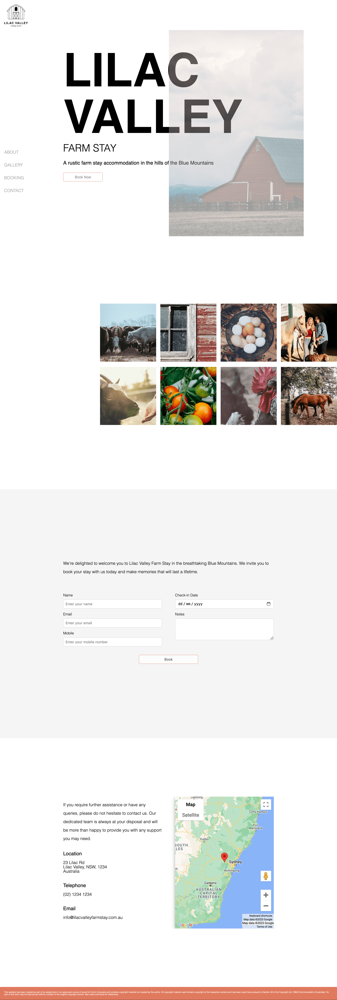
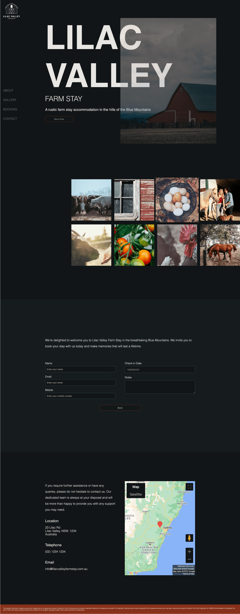

# lilac-valley

## Curtin University - Academic Integrity Warning
> "Curtin recognises that students who are unfamiliar with the conventions of academic writing can sometimes unintentionally plagiarise or collude on assessments. This may happen if you inadequately acknowledge resources or collaborate with other students when an assessment should be done individually. An academic integrity warning is used to assign you an educative action in these situations so you can learn from your mistakes. More serious academic breaches such as cheating are managed as misconduct."
For more information visit [Academic Integrity at Curtin](https://www.curtin.edu.au/students/essentials/rights/academic-integrity/)

This repository is for a fictitious website showcasing a rustic farm stay accommodation.

## Link

- [Website](https://inquisitive-conkies-fd473b.netlify.app)

## Screenshots

### Home Page

### Home Page - Dark Mode

### References

“Adding a Google Map with a Marker to Your Website.” 2019. Google Developers. 2019. https://developers.google.com/maps/documentation/javascript/adding-a-google-map.

“CSS Box Shadow.” n.d. Www.w3schools.com. https://www.w3schools.com/css/css3_shadows_box.asp.

“Css - My Position: Sticky Element Isn’t Sticky When Using Flexbox.” n.d. Stack Overflow. Accessed May 14, 2023. https://stackoverflow.com/questions/44446671/my-position-sticky-element-isnt-sticky-when-using-flexbox.

“How to Add an HTML Button That Acts like a Link.” n.d. Www.w3docs.com. https://www.w3docs.com/snippets/html/how-to-create-an-html-button-that-acts-like-a-link.html.

“Css - How to Make Flexbox Items the Same Size.” n.d. Stack Overflow. Accessed May 14, 2023. https://stackoverflow.com/questions/29503227/how-to-make-flexbox-items-the-same-size.

“CSS Object-Fit Property.” n.d. Www.w3schools.com. https://www.w3schools.com/css/css3_object-fit.asp.

“How to Create a Mobile Navigation Menu.” n.d. Www.w3schools.com. https://www.w3schools.com/howto/howto_js_mobile_navbar.asp.

“Html - Fill the Remaining Height or Width in a Flex Container.” n.d. Stack Overflow. https://stackoverflow.com/questions/37745051/fill-the-remaining-height-or-width-in-a-flex-container.

“Html - How to Change Border Color of Textarea on :Focus.” n.d. Stack Overflow. Accessed May 14, 2023. https://stackoverflow.com/questions/16156594/how-to-change-border-color-of-textarea-on-focus.

“Html - Make Anchor Tag Size to Its Div Content?” n.d. Stack Overflow. Accessed May 14, 2023. https://stackoverflow.com/questions/39248337/make-anchor-tag-size-to-its-div-content.

“HTML Textarea Tag.” n.d. Www.w3schools.com. https://www.w3schools.com/tags/tag_textarea.asp.

“SCSS/CSS Selector to Select All Input Types.” n.d. Stack Overflow. Accessed May 14, 2023. https://stackoverflow.com/questions/18085053/scss-css-selector-to-select-all-input-types.

W3Schools. 2019. “CSS Grid Layout.” W3schools.com. 2019. https://www.w3schools.com/css/css_grid.asp.

“W3Schools Online HTML Editor.” n.d. Www.w3schools.com. Accessed May 14, 2023. https://www.w3schools.com/howto/tryit.asp?filename=tryhow_js_mobile_navbar.

“W3Schools Online HTML Editor.” n.d. Www.w3schools.com. Accessed May 14, 2023. https://www.w3schools.com/howto/tryit.asp?filename=tryhow_js_mobile_navbar.

### Images

Gold, Dan. 2016. “Tomatoes Hanging on Tomato Plant.” Unsplash.com. Unsplash. August 14, 2016. https://unsplash.com/photos/4LiUI-Y2mI8.

Unsplash. n.d. “Photo by Annie Spratt on Unsplash.” Unsplash.com. Accessed May 14, 2023. https://unsplash.com/photos/uSqsYy-PIaM.

Unsplash. n.d. “Photo by Autumn Mott Rodeheaver on Unsplash.” Unsplash.com. https://unsplash.com/photos/YLyxXawZm4w.

Unsplash. n.d. “Photo by Brandon Mowinkel on Unsplash.” Unsplash.com. Accessed May 14, 2023. https://unsplash.com/photos/idw6R3T49uU.

Unsplash. n.d. “Photo by Courtney Coles on Unsplash.” Unsplash.com. Accessed May 14, 2023. https://unsplash.com/photos/h17jE3A2k5E.

Unsplash. n.d. “Photo by - - on Unsplash.” Unsplash.com. Accessed May 14, 2023. https://unsplash.com/photos/zENZO_qhpYQ.

Unsplash. n.d. “Photo by Intrapixel on Unsplash.” Unsplash.com. Accessed May 14, 2023. https://unsplash.com/photos/et7WYSz8vec.

Unsplash. n.d. “Photo by Lucas Vidart on Unsplash.” Unsplash.com. Accessed May 14, 2023. https://unsplash.com/photos/i-juS6HUX5o.

Unsplash. n.d. “Photo by Timothy Eberly on Unsplash.” Unsplash.com. Accessed May 14, 2023. https://unsplash.com/photos/UFLjsoyrKJc.

### Bibliography

“Color Palettes - Coolors.” n.d. Coolors.co. Accessed May 14, 2023. https://coolors.co/palettes/popular/3c6e71.

“Dribbble - Discover the World’s Top Designers & Creative Professionals.” n.d. Dribbble.com. https://dribbble.com.

“Google Fonts.” n.d. Google Fonts. Accessed May 14, 2023. https://fonts.google.com/?preview.text=Bookings&preview.text_type=custom&category=Serif.

Pinterest. 2019. “Pinterest (Australia).” Pinterest. Pinterest. 2019. https://www.pinterest.com.au.

Unsplash. 2019. “Beautiful Free Images & Pictures | Unsplash.” Unsplash.com. Unsplash. 2019. https://unsplash.com.
